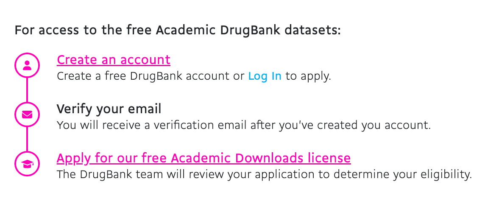

# NORM: OA Virtual Organoid Drug Candidate Generation

## 1. Input Specification

### 1.1 `task` (text, required)

In the osteoarthritis virtual organoid setting, use the provided papers and DrugBank data to generate ranked drug candidates for the next wet-lab round.

Objective: maximize cartilage-protective/regenerative potential while controlling inflammation risk.
Constraints: only purchasable candidates, exclude known high-toxicity compounds.
Output: 10 high-value candidates + 10 uncertain-but-promising candidates, each with metric and uncertainty.


### 1.2 `papers` (PDF, required)
papers were shared on WeChat with yinxi.
Suggested folder convention: `./inputs/papers/*.pdf`

### 1.3 `dataset` (required, current datasets = DrugBank + PrimeKG if graph tools are used)

#### DrugBank Download Guide
1. Register an account on the official DrugBank website and confirm license terms (academic/commercial as applicable).
2. Go to the release/download page and retrieve the current data package.
3. Store downloaded files locally (recommended path: `./inputs/drugbank/`).



Official entry point:
- https://go.drugbank.com/releases/latest

Notes:
- DrugBank has license constraints; unauthorized redistribution is not allowed.

#### PrimeKG Download Guide (required only when using PrimeKG tools)
1. Open the official PrimeKG repository: https://github.com/mims-harvard/PrimeKG
2. Follow the repository data instructions and download the PrimeKG CSV locally.
3. Store the file in a stable local path (recommended: `./inputs/primekg/primekg.csv`).

Notes:
- PrimeKG tools do not auto-download data; `primekg_csv_path` must point to an existing local CSV file.

### 1.4 `tools` (function calling, required)

Integrated tools in this project:
- PrimeKG tools:
  - `query_primekg_entities`
  - `query_primekg_neighbors`
  - `query_primekg_path`
- DeepDR ranking tool:
  - `rank_molecules_with_deepdr`
- Wet-lab result table tools (SQLite):
  - `init_wetlab_results_table`
  - `upsert_wetlab_results`
  - `update_wetlab_result`
  - `delete_wetlab_result`
  - `query_wetlab_results`

Tool prerequisites:
- PrimeKG tools require local `primekg_csv_path` input; recommended path: `./inputs/primekg/primekg.csv`; no automatic download.
- DeepDR tool requires:
  - installed `deepdr` package (written in dependencies)
  - `inference_config.json` under `deepdr_artifact_dir`
  - `inference_config.json` includes `model_path` and `score_direction`
- SQL tools require:
  - writable local SQLite `db_path`

## 2. Output Specification (Strict)

The output must be a JSON object with the following top-level keys:
- `high_value_candidates`
- `uncertain_candidates`
- `metadata`

### 2.1 Unified Candidate Schema (for both high-value and uncertain sets)
Each candidate must include:
- `rank`: integer, starting from 1
- `product_name`: human-procurement-facing drug product name
- `drugbank_id`: DrugBank ID for the candidate compound
- `smiles`: canonical SMILES string for the candidate compound
- `uncertainty`: float in [0, 1] (higher means more uncertain)
- `evidence_summary`: text summarizing core evidence (papers/graph/model)
- `mechanism_hypothesis`: text hypothesis of mechanism of action
- `safety_or_feasibility_note`: text note for procurement/experimental feasibility


### 2.2 Output JSON Example
```json
{
  "high_value_candidates": [
    {
      "rank": 1,
      "product_name": "DrugA",
      "drugbank_id": "DB00001",
      "smiles": "CCO",
      "uncertainty": 0.60,
      "evidence_summary": "Supported by OA paper #2 and PrimeKG path evidence.",
      "mechanism_hypothesis": "May reduce inflammation and support matrix synthesis.",
      "safety_or_feasibility_note": "Purchasable from standard vendors; suitable for dose-response pilot."
    }
  ],
  "uncertain_candidates": [
    {
      "rank": 1,
      "product_name": "DrugC",
      "drugbank_id": "DB00003",
      "smiles": "CCC",
      "predicted_effect": 0.72,
      "uncertainty": 0.78,
      "evidence_summary": "Model suggests benefit but literature evidence is limited.",
      "mechanism_hypothesis": "Potential pathway modulation requires validation.",
      "safety_or_feasibility_note": "Available for procurement; prioritize low-dose pilot."
    }
  ],
  "metadata": {
    "task": "OA virtual organoid candidate generation",
    "domain_context": "osteoarthritis virtual organoid",
    "drugbank_version": "fill_actual_version",
    "papers_used": ["paper_1.pdf", "paper_2.pdf"],
    "toolchain": [
      "query_primekg_entities",
      "query_primekg_neighbors",
      "query_primekg_path",
      "rank_molecules_with_deepdr"
    ],
    "generated_at": "2026-02-26T00:00:00Z"
  }
}
```
